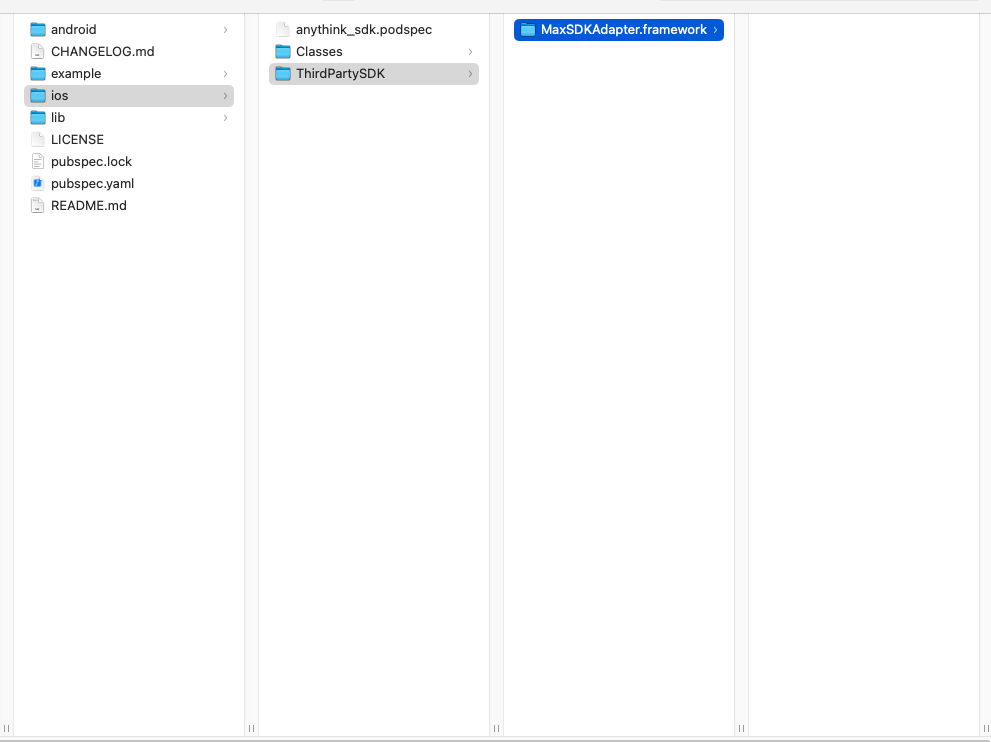
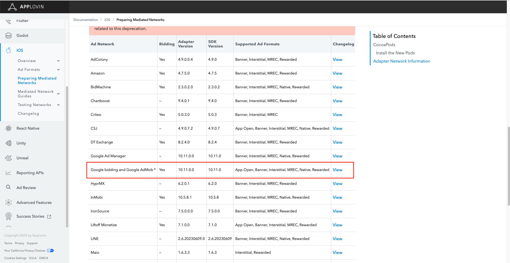
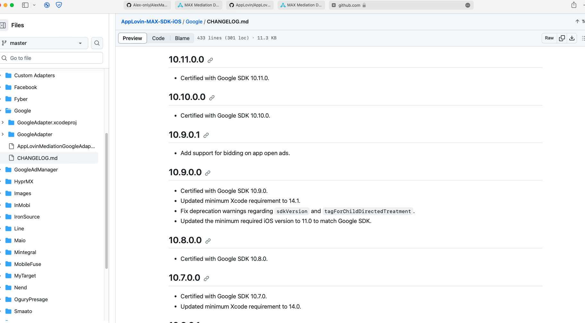
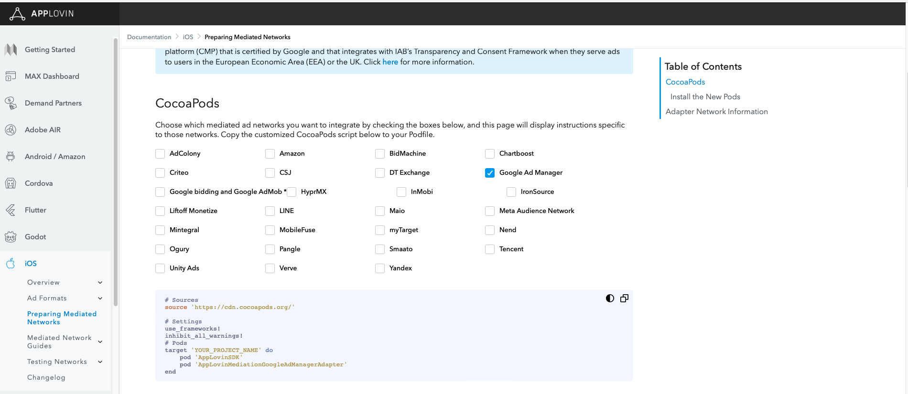
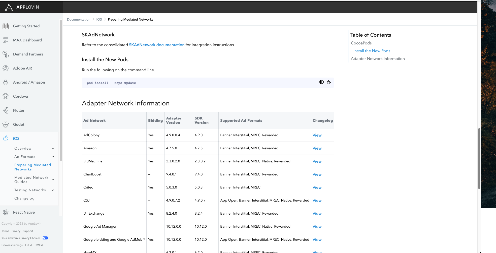
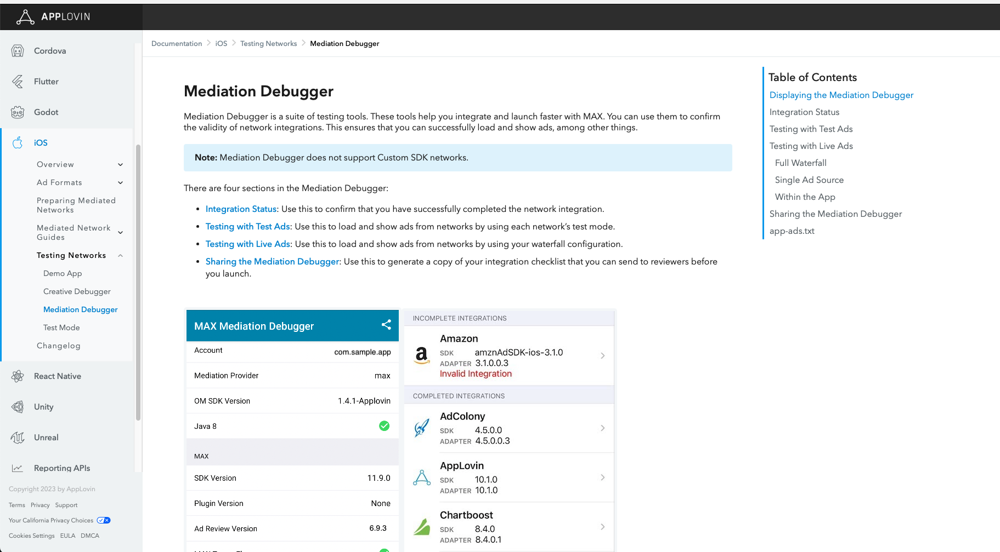
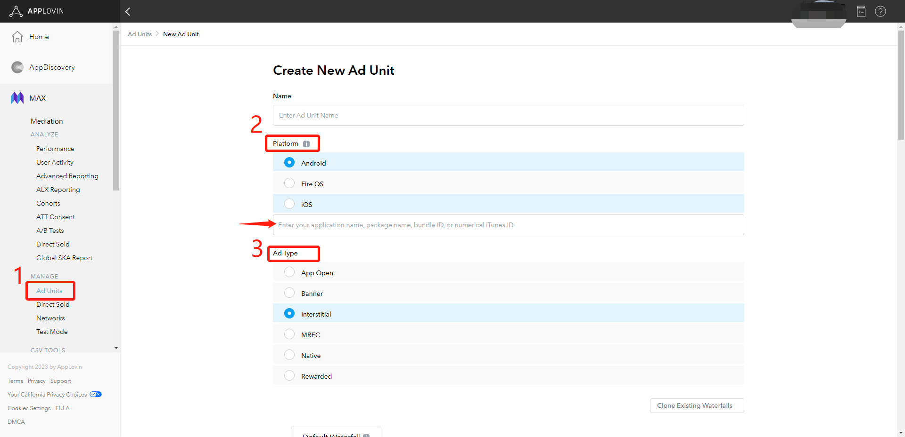
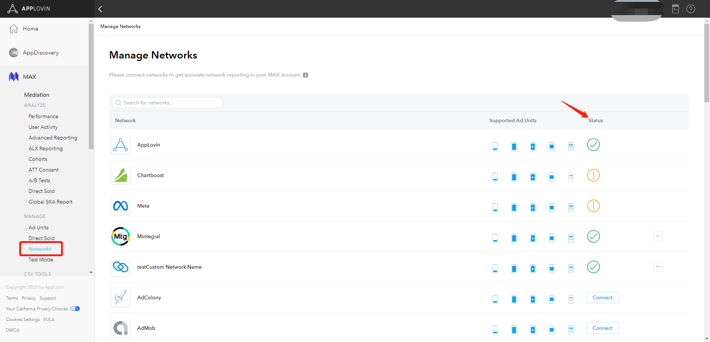
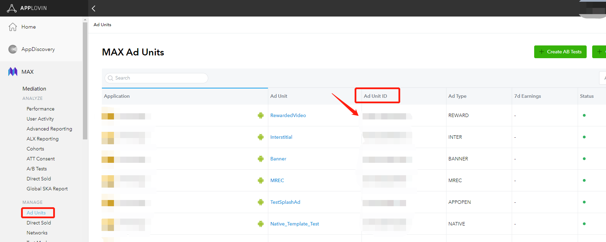
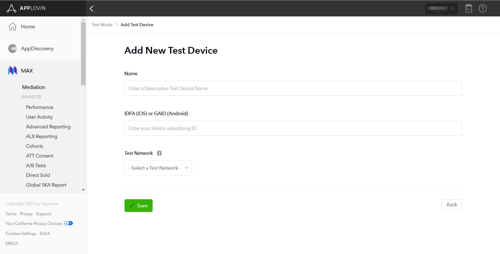

# AlexMaxDemo_iOS

# Version description

| Version      | TopOn SDK Version              |   Applovin version     |
| ------------ | ------------------------------ | ---------------------- |
| 1.0.8.x      | =6.4.12                        | = 13.0.1               |
| 1.0.9.2      | =6.4.76,6.4.87                 | = 13.2.0               |
| 1.1.01       | =6.4.88,6.4.89,6.4.91          | = 13.3.1               |
| 1.1.02       | =6.4.92                        | = 13.4.0               |
| 13.4.0.0     | =6.4.94,6.5.31                 | = 13.4.0               |

⚠️⚠️⚠️ Note ⚠️⚠️⚠️
Since the TopOn SDK was refactored from version 6.4.94, starting from version 13.4.0.0, manual export of AlexMaxAdapter is supported. The steps are as follows: 

1. Go to the AlexMaxAdapter-xx.x.x.x/AlexMaxAdapter path and execute "pod install --repo-update" to install the dependencies. 
2. After the first step is completed successfully, AlexMaxAdapter.xcworkspace will be generated. Double-click to open it, select the AlexMaxAdapter target, and compile to generate the AlexMaxAdapter framework file.

Other:

1. Added support for MAX's native self-rendered ad integration. Currently compatible with Applovin, Admob, and Pangle. Please refer to the [MaxAdapter support versions](https://dash.applovin.com/documentation/mediation/ios/ad-formats/native-manual) for more information.

# Integration

## 1. Access TopOn SDK

  Recommend updating to TopOn 6.4.92 and AlexMaxAdapter version 1.1.02.

## 2 Introducing Max SDK&Alex Adapter

### iOS

#### 1. Import Max SDK

```
pod 'AppLovinSDK','xx.x.x'
```
 
#### 2. Import AlexMaxAdapter

1.To add the source code from the "Max" folder or the "AlexMaxAdapter.framework" to your project


#### 3. Import Masonry
```
pod 'Masonry'
```
 

###  Unity Platform

We just need to import the AlexMaxAdapter.framework into the path，`Assets/AnyThinkAds/Plugins/iOS`，


To add the AlexMaxAdapter.framework to your Xcode project using a Podfile,  pod install

```
pod 'AppLovinSDK'
```

###  Flutter

To import the AlexMaxAdapter.framework into the specified path `plugins/anythink_sdk/ios/ThirdPartySDK` and then install the dependencies using `pod install`




### 3. The Key used in the Adapter

```
"sdk_key": SDK Key of advertising platform
"unit_id": Advertising slot ID of the advertising platform
"unit_type": Ad slot type, 0: Banner, 1: MREC
```

The JSON configuration example when adding an ad source in the background is as follows: (xxx needs to be replaced with the actual SDK key and ad slot ID of Max, and "unit_type" does not need to be configured for non-banner ad slots)

```json
{
    "sdk_key":"xxx",
    "unit_id":"xxx",
    "unit_type":"0"
}
```


## 3. Max integrates with other advertising platforms

<font color='red'>If you do not need to access other advertising platforms through Max, you can skip this part.</font>

### 1.Determine advertising platform

1. To determine the compatible AdMob version for your TopOn version (v6.2.75), you can refer to the TopOn . It will provide you with the information about the AdMob version compatible with your TopOn version. For example, if the documentation states that TopOn v6.2.75 is compatible with AdMob v10.8.0, then you should use AdMob v10.8.0 for integration.
2. After determining the compatible AdMob version (v10.11.0.0) from the previous step, you can visit the [Max Mediation documentation](https://dash.applovin.com/documentation/mediation/android/mediation-adapters#adapter-network-information) to find the corresponding adapter version. In this case, since you are using Max SDK version 11.11.3 and AdMob version 10.11.0.0, you would look for the Max adapter version that matches AdMob version 10.11.0.0.



**Notice:**

(1) If you cannot find the Adapter corresponding to Admob v10.8.0, you can find the corresponding Adapter version by checking the Changelog of the Adapter.



(2) Make sure that both TopOn and Max are compatible with Admob SDK


### 2. Introduce advertising platform Adapter

```
pod 'AppLovinMediationGoogleAdapter','10.11.0.0'
```


### 3. Additional configuration of the advertising platform

Enter the [Preparing Mediated Networks](https://dash.applovin.com/documentation/mediation/ios/mediation-adapters) page, then check Admob and perform additional configuration according to the generated configuration instructions.

**Note**: The corresponding application ID of the `GADApplicationIdentifier` configured in Info.plist must be consistent with the application ID in the Admob advertising source configured in the TopOn background.







### 4. Verify integration

4.1 Call the following code to open Max’s Mediation Debugger tool

**Note：**

- Among them, sdkKey is the SDK Key of Max background.
- After testing, you need to delete this code

```objective-c
 [[ALSdk sharedWithKey:@"sdkKey"] showMediationDebugger];
```


4.2  Enter the[Mediation-Debugger](https://dash.applovin.com/documentation/mediation/ios/testing-networks/mediation-debugger) page and follow the steps below to verify whether the advertising platform integration is normal.




## 4. TopOn dashboard configuration

1. You need to add a Custom Network.


2. Choose "Custom Network". Fill in Network Name/Account Name and Adapter's class names according to the contents above.
   *Network Name needs to contain Max to distinguish the Network. Example: Max_XXXXX,

The files used in the SDK for this article are named:

RewardedVideo：AlexMaxRewardedVideoAdapter<br/>
Interstitial：AlexMaxInterstitialAdapter<br/>
Banner：AlexMaxBannerAdapter<br/>
Native：AlexMaxNativeAdapter<br/>
Splash：AlexMaxSplashAdapter<br/>

If the developer has modified the file name in the source code behind, please use the modified name to fill in the background.


3. Mark the Network Firm ID


4. You can add the Ad Sources after adding the Network.

5. You can edit the placement setting to fill the report api key.


## 5. Max setting

### Step1.Create Max account

Log in to the [MAX](https://dash.applovin.com/o/mediation) official website to apply for an account


### Step2.Create MAX app and ad unit

Create app and ad unit in MAX-->Manage-->Ad Units




### Step3.Complete Network information configuration in MAX




### Step4. MAX Advertisement Description

The corresponding relationship between MAX’s Unit and TopOn’s placement type is as follows:

| MAX-Unit     | TopOn-Ad Type |
| ------------ | -------------- |
| Banner       | Banner         |
| Interstitial | Interstitial   |
| Rewarded     | Rewarded Video |
| App Open     | Splash         |
| Native       | Native         |


### Step5.  Configure MAX unit

#### 5.1  Configure the unit of MAX

5.1.1 Obtain the Ad Unit ID of MAX through the following path: MAX-->Manage-->Ad Units



5.1.2. Configure MAX parameters in the TopOn

1. Add an ad source, log in to the TopOn → Mediation → Add ad source


## 6. Test Max ads

<font color='red'>Please make sure you have followed the instructions above to create applications and advertising placement in the Max backend and configure them under the advertising placement in the TopOn backend.</font>

1. Open the log of TopOn SDK

```objective-c
  [ATAPI setLogEnabled:YES];//The SDK log function is recommended to be turned on during the integration testing phase and must be turned off before going online.
```

### 2. Open Max's test mode

Enter the [MAX - Test Mode](https://dash.applovin.com/o/mediation/test_modes) page, click the `Add Test Device` button, and fill in the GAID obtained above in the input box of IDFA (iOS) or GAID (Android), then select the advertising platform that needs to be tested, and click `Save` to save it.



> For more information, please refer to  [MAX Test Mode](https://dash.applovin.com/documentation/mediation/android/testing-networks/test-mode)


### 3.  Load & display ads

After adding the test device to the Max backend, please wait for 5 to 10 minutes. After the configuration takes effect, call the relevant methods of the TopOn SDK to load and display the TopOn placement to verify whether the integration of the Max advertising is normal.
