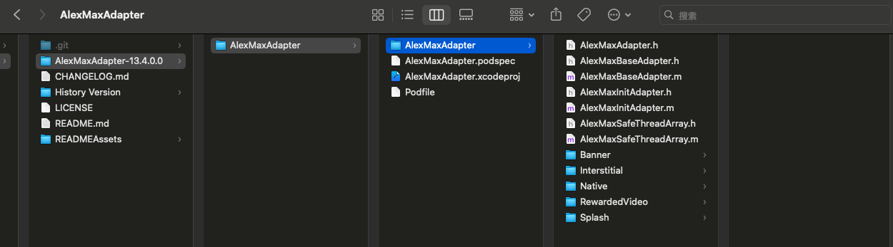
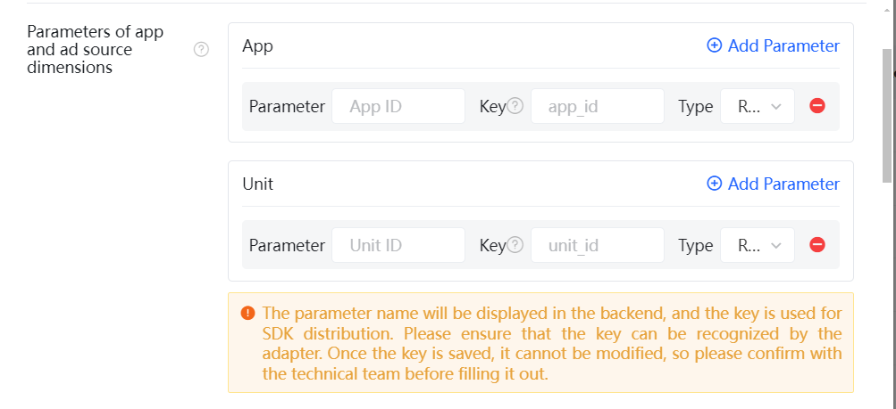

# AlexMaxDemo_iOS

# Version description

| Version      | TopOn SDK Version              |   Applovin version     |
| ------------ | ------------------------------ | ---------------------- |
| 1.0.8.x      | =6.4.12                        | = 13.0.1               |
| 1.0.9.2      | =6.4.76,6.4.87                 | = 13.2.0               |
| 1.1.01       | =6.4.88,6.4.89,6.4.91          | = 13.3.1               |
| 1.1.02       | =6.4.92                        | = 13.4.0               |
| 1.1.03(Recommended)       | =6.4.93                        | = 13.4.0               |
| 13.4.0.1     | =6.4.94,6.5.31,6.5.32          | = 13.4.0               |

# Integration

## Please use the recommended version, current is 1.1.03 & TopOn v6.4.93

## 1. Access TopOn SDK

  It is recommended that you visit the TopOn SDK download center to obtain the latest version and select the corresponding AlexMaxAdapter for integration based on that version number.

## 2. Import Max SDK and AlexMaxAdapter

### iOS

#### 1. Import Max SDK

```
pod 'AppLovinSDK','xx.x.x'
```
 
#### 2. Import AlexMaxAdapter

There are two ways to import AlexMaxAdapter.

Method 1: To add the source code from the "AlexMaxAdapter-xx.x.x.x/AlexMaxAdapter/AlexMaxAdapter" folder 


  
Method 2: Generate and drag "AlexMaxAdapter.framework" to your project
 
Since the TopOn SDK was refactored from version 6.4.94, starting from version 13.4.0.0, manual export of AlexMaxAdapter.framework is supported. The steps are as follows: 

Step 1. Go to the AlexMaxAdapter-xx.x.x.x/AlexMaxAdapter path and execute "pod install --repo-update" to install the dependencies. 
Step 2. After the first step is completed successfully, AlexMaxAdapter.xcworkspace will be generated. Double-click to open it, select the AlexMaxAdapter target, and compile to generate the AlexMaxAdapter.framework file.


For versions of AlexMaxAdapter below 13.4.0.0, Masonry also needs to be included.
```
pod 'Masonry' 
``` 
 
## 3. TopOn dashboard configuration

1. Please add the custom ad network according to the documentation: https://help.toponad.net/docs/Custom-Network-integration-instructions
  
The files used in the SDK by default are named:

RewardedVideo：AlexMaxRewardedVideoAdapter<br/>
Interstitial：AlexMaxInterstitialAdapter<br/>
Banner：AlexMaxBannerAdapter<br/>
Native：AlexMaxNativeAdapter<br/>
Splash：AlexMaxSplashAdapter<br/>

If you has modified the adapter file name in the source code, please use the modified name to fill in the TopOn dashboard.


2. Add parameters for app and ad source dimension configuration

```
"sdk_key": SDK Key of Max
"unit_id": Advertising slot ID of the Max
"unit_type": Ad slot type, 0: Banner, 1: MREC, does not need to be configured for non-banner ad slots
```
  

  
## 4. Test Max ads

<font color='red'>Please make sure you have create applications and advertising placement in the Max dashboard and configure them under the advertising placement in the TopOn dashboard.</font>

1. Open the log of TopOn SDK

```objective-c
  [ATAPI setLogEnabled:YES];//The SDK log function is recommended to be turned on during the integration testing phase and must be turned off before going online.
```

2. Open Max's test mode

Enter the [MAX - Test Mode](https://dash.applovin.com/o/mediation/test_modes) page, click the `Add Test Device` button, and fill in the GAID obtained above in the input box of IDFA (iOS), then select the advertising platform that needs to be tested, and click `Save` to save it.
 
> For more information, please refer to  [MAX Test Mode](https://dash.applovin.com/documentation/mediation/android/testing-networks/test-mode)

 
3.  Load & display ads

After adding the test device to the Max backend, please wait for 5 to 15 minutes. After the configuration takes effect, call the relevant methods of the TopOn SDK to load and display the TopOn placement to verify whether the integration of the Max advertising is normal.
