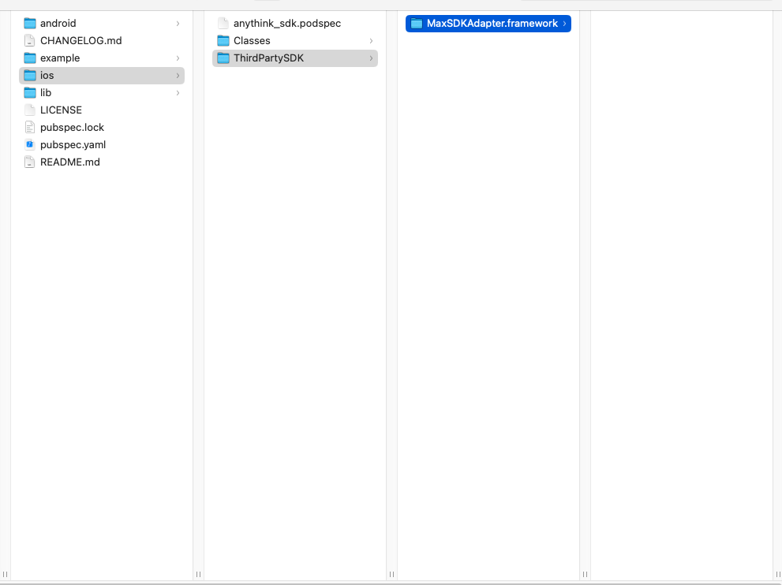
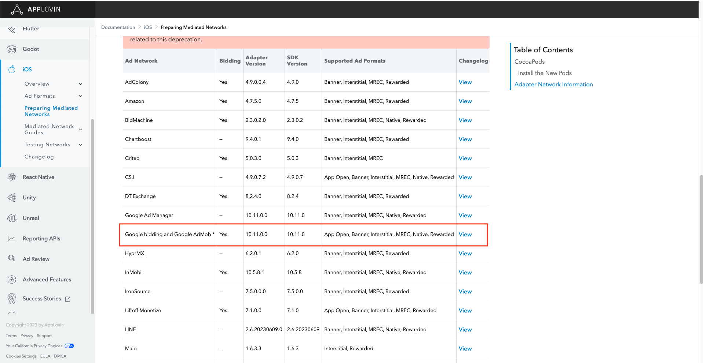
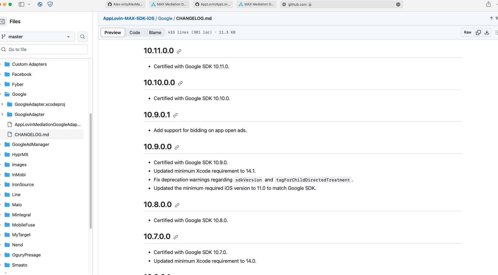
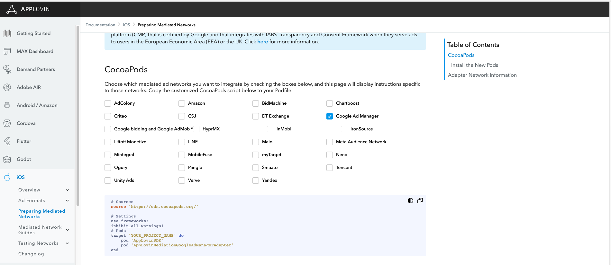
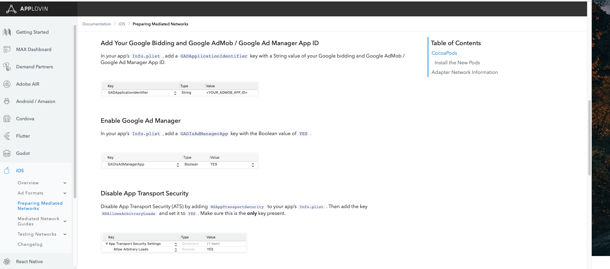
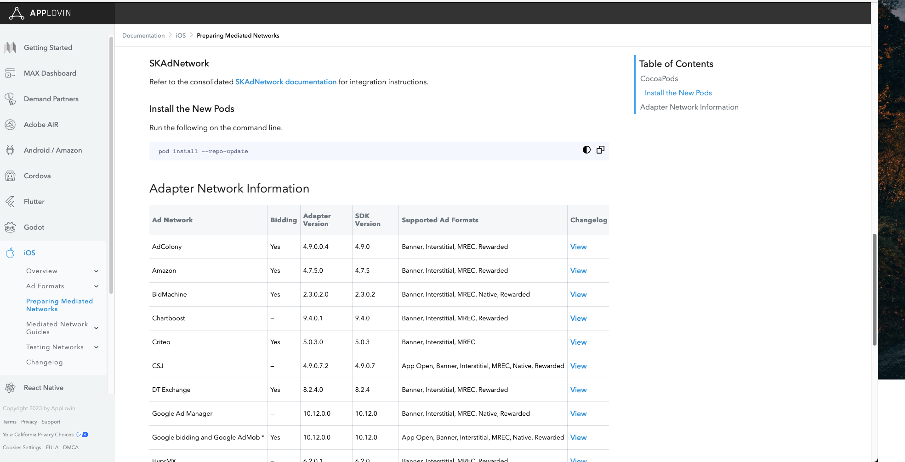
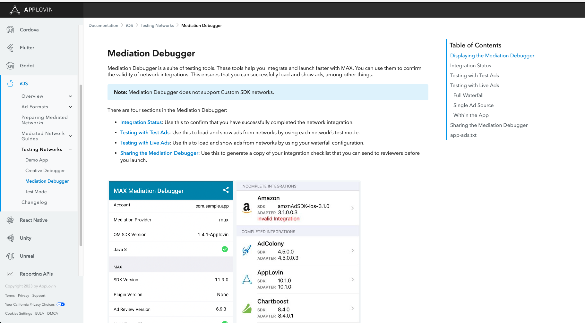

# AlexMaxDemo_iOS

# 版本说明

| Version     | TopOn SDK Version              |   Applovin version     |
| ------------ | --------------------------- | --------------- |
| 1.0.8.x | =6.4.12 | = 13.0.1 |
| 1.0.9 | =6.4.76,6.4.87 | = 13.2.0 |
| 1.1.0 | =6.4.88 | = 13.3.1 |

!!!警告!!!
从1.0.9版本开始，请所有开发者都使用xcframework引入至工程，源码将引入将不再支持。


其他点：
1.支持Max的自渲染广告接入，目前能适配Applovin，Admob，Pangle 的接入，[MaxAdapter支持版本](https://dash.applovin.com/documentation/mediation/ios/ad-formats/native-manual)


# 集成

Tip: If necessary, please refer to [the English documentation](https://github.com/Alex-only/AlexMaxDemo_iOS/blob/main/README_EN.md)

## 一. 接入TopOn SDK

TopOn SDK，建议接入**TopOn v6.1.65及以上版本**

## 二. 引入Max SDK&Alex Adapter

### iOS

#### 1. 引入Max SDK

```
pod 'AppLovinSDK'
```


#### 2. 引入Alex Adapter

1.将 Max 文件夹下源代码 或者 MaxSDKAdapter.framework 拖入项目中


#### 3. 引入Masonry
```
pod 'Masonry'
```

###  Unity平台

我们只需要把 MaxSDKAdapter.framework 导入到路径中，`Assets/AnyThinkAds/Plugins/iOS`，如图所示


在Xcode中的Podfile文件添加，添加完毕后使用 pod install进行依赖。

```
pod 'AppLovinSDK'
```

###  Flutter平台

我们只需要把 MaxSDKAdapter.framework 导入到路径中，`plugins/anythink_sdk/ios/ThirdPartySDK`，添加完毕后使用 pod install进行依赖。




### 3. Adapter中使用的Key说明

```
"sdk_key": 广告平台的SDK Key
"unit_id": 广告平台的广告位ID
"unit_type": 广告位类型，0: Banner, 1: MREC
```

后台添加广告源时的JSON配置示例如下：（xxx需要替换为Max实际的SDK key以及广告位ID，非横幅广告位不需要配置"unit_type"）

```json
{
    "sdk_key":"xxx",
    "unit_id":"xxx",
    "unit_type":"0"
}
```


## 三. Max接入其他广告平台

<font color='red'>如果不需要通过Max接入其他广告平台，可跳过此部分内容。</font>

### 1.确定广告平台Adapter版本

1、先到 TopOn后台，查看接入的TopOn版本兼容的Admob版本是多少？（TopOn v6.2.75版本兼容的Admob版本为v10.8.0）

2、然后到 [Max后台](https://dash.applovin.com/documentation/mediation/android/mediation-adapters#adapter-network-information)，根据接入的Max SDK版本（v11.11.3）和Admob版本（v10.11.0.0），查找对应的Adapter版本（v10.11.0.0）



**注意：**

（1）如果找不到Admob v10.8.0对应的Adapter，可通过查看Adapter的Changelog，找到对应的Adapter版本



（2）需确保TopOn和Max都兼容Admob SDK


### 2. 引入广告平台Adapter

```
pod 'AppLovinMediationGoogleAdapter','10.11.0.0'
```


### 3. 广告平台的额外配置

进入[Preparing Mediated Networks](https://dash.applovin.com/documentation/mediation/ios/mediation-adapters)页面，然后勾选Admob，根据生成的配置说明，进行额外配置

**注意**：配置在Info.plist中的`GADApplicationIdentifier`，其对应的应用ID，必须与TopOn后台配置的Admob广告源中的应用ID一致








### 4. 验证集成

4.1 调用以下代码，开启Max的Mediation Debugger工具

**注意：**

- 其中sdkKey为Max后台的SDK Key
- 测试完毕后，需删除此代码

```objective-c
 [[ALSdk sharedWithKey:@"sdkKey"] showMediationDebugger];
```


4.2 进入[Mediation-Debugger](https://dash.applovin.com/documentation/mediation/ios/testing-networks/mediation-debugger)页面，按照以下步骤，验证广告平台集成是否正常




## 四. 后台配置

1、按照SDK对接文档接入同时，需要在后台添加自定义广告平台


2、选择【自定义广告平台】，填写广告平台名称、账号名称，按照SDK的对接文档填写Adapter.  
   ps:(广告平台名称需要写上Max，便于区分广告平台，建议名称格式：Max_XXXXX)


将对应adapter的类名填入相关位置
本文的SDK所使用的文件命名为：

激励视频：AlexMaxRewardedVideoAdapter<br/>
插屏广告：AlexMaxInterstitialAdapter<br/>
横幅广告：AlexMaxBannerAdapter<br/>
原生信息流：AlexMaxNativeAdapter<br/>
开屏广告：AlexMaxSplashAdapter<br/>

如果开发者后面有源码中的文件名字修改了，请使用修改后的命名填入后台。


3、记录广告平台ID


4、广告平台添加完成后，需要等待15min左右，再添加广告源（添加广告源时按照对应样式配置即可）

5、可编辑广告平台设置，选择是否开通报表api并拉取数据


## 五. Max后台配置

### Step1.创建MAX帐号

登录[MAX官网](https://dash.applovin.com/o/mediation)申请开通账号


### Step2.创建MAX的应用和广告单元

在MAX-->Manage-->Ad Units中创建应用和广告位


### Step3.在MAX完成Network信息配置


### Step4. MAX广告位说明

MAX的Unit跟TopOn的广告类型对应关系如下：

| MAX-Unit     | TopOn-广告类型              |
| ------------ | --------------------------- |
| Banner       | 横幅广告 Banner             |
| Interstitial | 插屏广告 Interstitial       |
| Rewarded     | 激励视频广告 Rewarded Video |
| App Open     | 开屏广告 Splash             |
| Native       | 原生广告 Native             |


### Step5. 在后台配置MAX广告位

#### 5.1 配置MAX 的广告源

5.1.1 通过以下路径获取MAX 的Ad Unit ID：MAX-->Manage-->Ad Units


5.1.2. 将MAX的参数配置在TopOn后台

添加广告源，登录TopOn后台→广告平台→变现平台→广告源管理（Max）→添加广告源


## 六、测试Max广告

<font color='red'>请确保已经按照上方说明，已经在Max后台创建好应用和广告位，并将其配置到TopOn后台的广告位下</font>

1. 打开TopOn SDK的日志

```objective-c
  [ATAPI setLogEnabled:YES];//SDK日志功能，集成测试阶段建议开启，上线前必须关闭
```

### 2. 打开Max的测试模式

进入[MAX - Test Mode](https://dash.applovin.com/o/mediation/test_modes)页面，点击`Add Test Device`按钮，在IDFA (iOS) or GAID (Android)的输入框中填入上面获取到的GAID，然后选择需要进行测试的广告平台，点击`Save`进行保存。


> 更多信息，请参考 [MAX Test Mode](https://dash.applovin.com/documentation/mediation/android/testing-networks/test-mode)


### 3. 加载&展示广告

在Max后台添加测试设备后，请等待5~10分钟，待配置生效后，调用TopOn SDK的相关方法进行TopOn广告位的加载&展示，验证Max广告的集成是否正常


